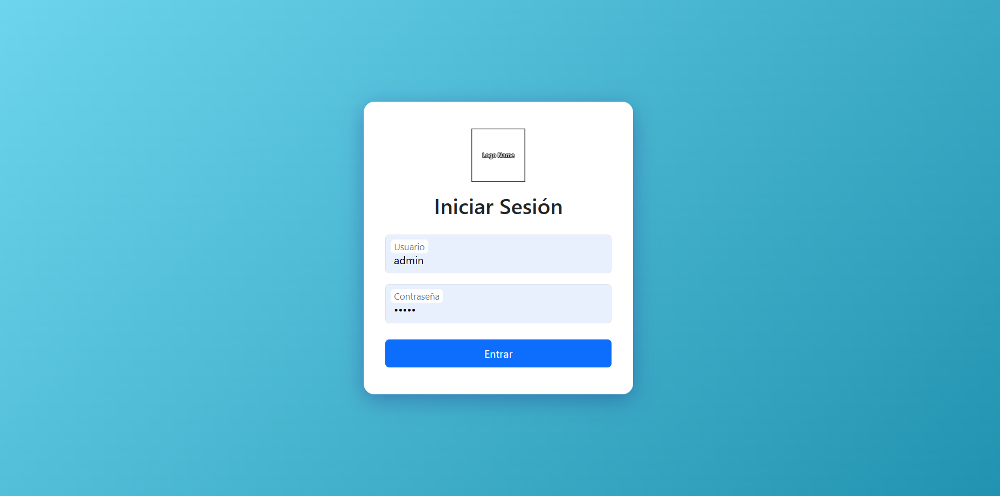

# Proyecto Visas 2.0

Resumen
-------
Sistema sencillo para gestionar clientes, requisitos, entrevistas y pagos relacionados con trámites de visas. Está dividido en `app` (lógica, vistas, config) y `public` (entrada, assets).

Fue para una empresa por lo que logos e imagenes están ocultas, pueden ser modificadas y entonces se verá mucho mejor la applicación web.

Imagenes resumen
---------------




Estado
------
Funcional en entorno local (XAMPP). Login sin registro (usuario fijo).

Requisitos
---------
- XAMPP (Apache + MySQL)
- PHP 7.4+ (o versión compatible)
- Base de datos MySQL configurada

Instalación y ejecución (local)
------------------------------
1. Copia la carpeta `Proyecto_Visas_2.0` en `c:\xampp\htdocs\`.
2. Inicia Apache y MySQL desde el panel de XAMPP.
3. Crea la base de datos y las tablas necesarias (usa tu script SQL).
4. Actualiza la conexión a BD en `app/config/conexion.php`.
5. Accede en el navegador:
   - Página de login: `http://localhost/Proyecto_Visas_2.0/public/login.php`
   - Inicio (protegido): `http://localhost/Proyecto_Visas_2.0/public/inicio.php`

Credenciales por defecto
------------------------
- Usuario: el que quiera el cliente.
- Contraseña: el que quiera el cliente.

Estructura principal
--------------------


Qué revisar/ajustar
-------------------
- `app/config/conexion.php`: poner host, usuario, contraseña y nombre de BD correctos.
- `public/login.php`: si cambias credenciales, actualízalas aquí.
- Rutas de recursos: se usan rutas absolutas desde la raíz del proyecto (`/Proyecto_Visas_2.0/public/...`) o rutas relativas correctas.
- Proteger vistas: cada vista debe iniciar sesión con `session_start()` y comprobar `$_SESSION['usuario']`.

Iconos y estilos
---------------
Se usan Bootstrap y Bootstrap Icons por CDN. Asegúrate de que en el `<head>` de tus vistas esté:
```html
<link href="https://cdn.jsdelivr.net/npm/bootstrap@5.3.3/dist/css/bootstrap.min.css" rel="stylesheet">
<link rel="stylesheet" href="https://cdn.jsdelivr.net/npm/bootstrap-icons@1.11.3/font/bootstrap-icons.min.css">
<link rel="stylesheet" href="/Proyecto_Visas_2.0/public/css/estilos.css">
```
Y antes de `</body>`:
```html
<script src="https://cdn.jsdelivr.net/npm/bootstrap@5.3.3/dist/js/bootstrap.bundle.min.js"></script>
<script src="/Proyecto_Visas_2.0/public/js/main.js"></script>
```
Imagenes del proyecto
---------------


Buenas prácticas
---------------
- Mantén todas las imágenes de la app dentro de `public/img/` y refiérelas con rutas relativas en README.
- Evita rutas absolutas locales (`C:\...`) en el README: usa rutas relativas (`public/img/imagen.png`) o URLs públicas.
- Si compartes el proyecto por GitHub, el README mostrará las imágenes si están versionadas en el repo.


Contacto
--------
Sebastián Escobar
escobarsebastian1230@gmail.com